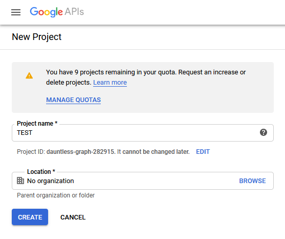
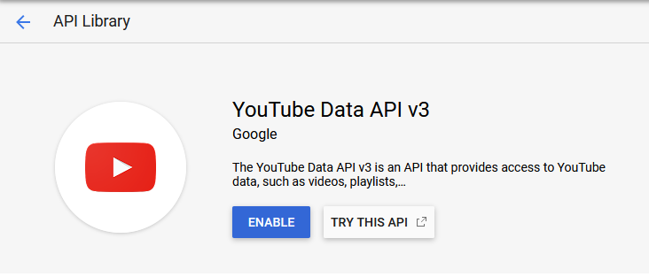
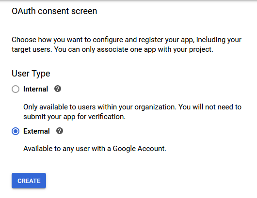
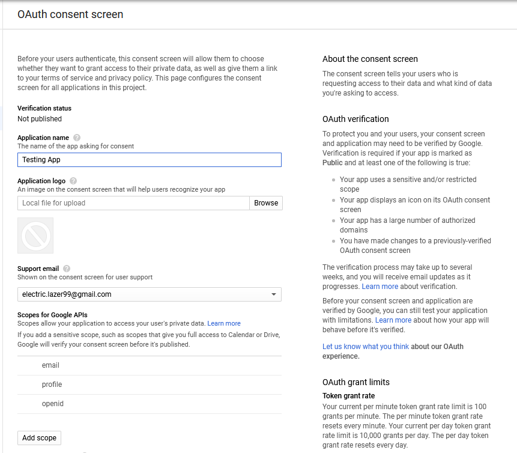
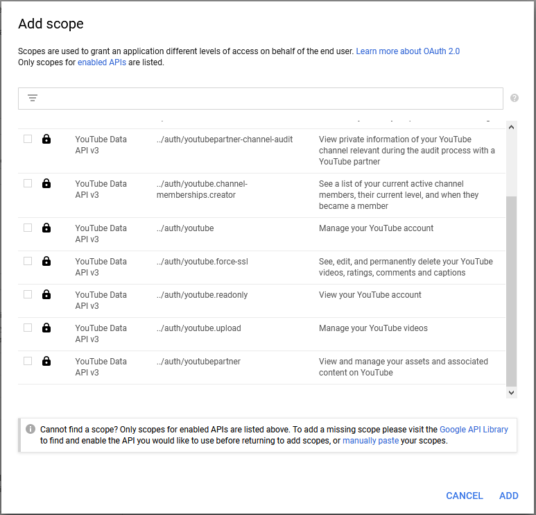
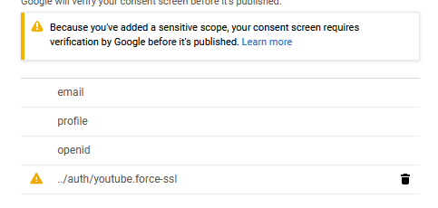
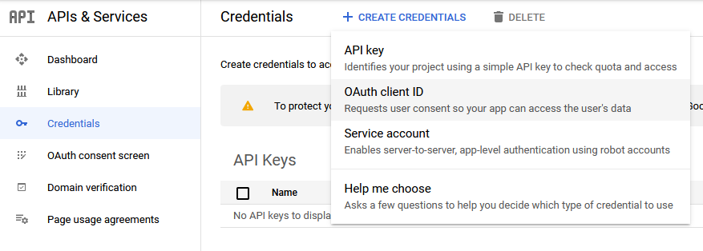
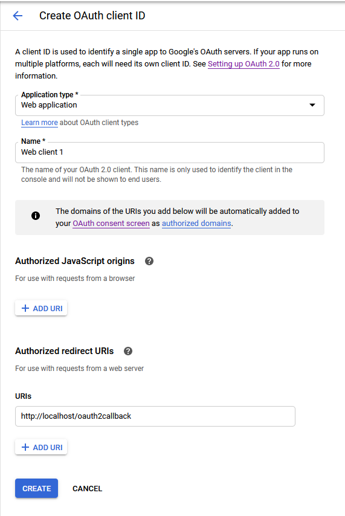
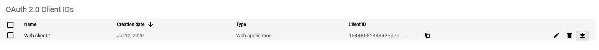
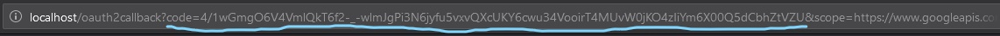

# youtube-video-updater
 📺 Essentially a bot that updates video metadata 📺

I got inspiration from Tom Scott's [video](https://www.youtube.com/watch?v=BxV14h0kFs0). I got the urge to try out YouTube's API and operate on that.

# How to make it work?

In advance, I want to say sorry if I don't explain enough. This guide is bare minimum on how to get tokens and authorization to use your bot to edit video's metadata and such. Would be advised to check the code before you decide to launch it, add in your info that you need or remove some stuff that you don't want to add. This is just an example code I wrote to work with. Here's also a [full documentation of YouTube Data API v3](https://developers.google.com/youtube/v3/getting-started) to use. All I am saying now is, have fun!

Here's a user guide on how to do it exactly. Make sure you have a Google account. If not, simply make one. After account creation, do the following:

1. Go to [Google's APIs & Services page](https://console.developers.google.com)

2. Make a new project, choose your project name to your liking


3. From APIs & Services, go to Library
  - Search up YouTube Data API v3
  - Click Enable to use that API
  

4. Configure your OAuth consent screen
  - Choose User Type: External
  
  - Type in your application name to your liking, other fields are optional
  
  - Click Add scope, and from there `../auth/youtube.force-ssl` scope should do for this project
  
    - Since it's a sensitive scope, you should get a little warning prompt that says you need to submit your application for verification. And also since it is mainly one-user application, we don't need to verify the app. Submitting for verification is optional in this project's context
    

5. Go to Credentials tab, click Create Credentials and from there pick OAuth client ID.

  - Pick Application type: Web application
  - Type in your web client name to your liking
  - Click Add URI under Authorized redirect URIs. In there put `http://localhost/oauth2callback`. Anything works really, though keep in mind your redirect URI. It is relevant in one of upcoming steps
  
  - Click Create and, download your client secret JSON file
  

6. Navigate to your just downloaded client secret JSON file. Move it to the bot's working directory and rename it to `client_secret.json`

7. Paste in the URI to the address bar:
```
https://accounts.google.com/o/oauth2/auth?scope=https://www.googleapis.com/auth/youtube.force-ssl&
response_type=code&
access_type=offline&
redirect_uri={insert your redirect URI here}&
client_id={insert your OAuth client ID from the client secret file here}
```
  - Pick your email account, and from there pick your channel which has video(s) on its channel you want bot to edit
  - You'll get a warning where it says the app isn't verified. Click Advanced and pick Go To <Your app name> (unsafe)
  
  - After that click Allow to allow the app to manage your YouTube videos on your channel

8. You'll be redirected to your set redirect URI with query that contains code.

  - Make a new file called `tokens.json`
  - Copy the code from the code parameter in the query into the tokens file like so:
  ```json
  {
    "auth_code": "4/1..."
  }
  ```

10. Do the rest on your own. Install NPM and Node.js to your system, edit the bot to your liking, have fun.

As soon as you launch the bot for the first time, it will create a refresh token and store it inside tokens file. It is a unique token for refreshing the access token. Access tokens expire in 1 hour, refresh tokens are unique as they give another access token to use.

# 

Have a nice day, Bluntano out!